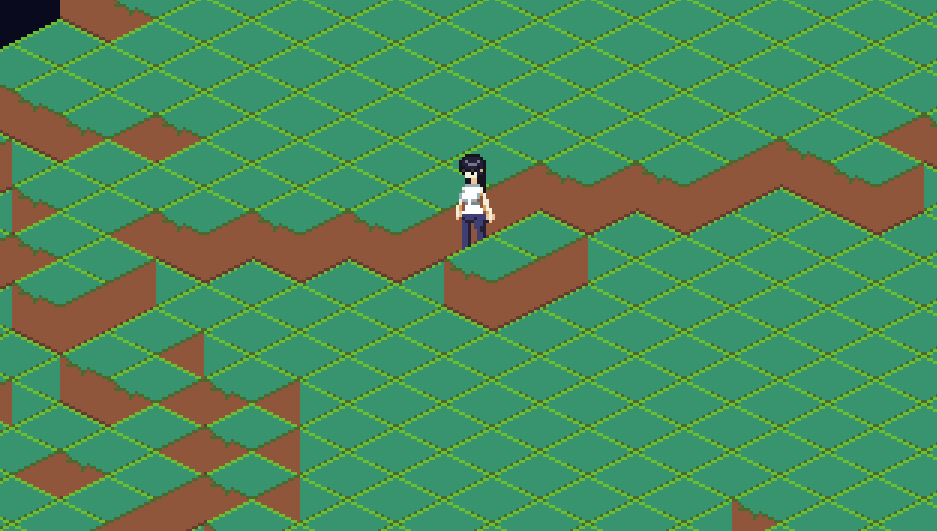

# Part of Personal Game Project in Go (as fast demo)
- Some Simple experiment 2D Collision works like 3D in Ebitengine (Kinda Left it for more than 6 months)
- Full Version is Written in Java LWJGL without Game Engine (Creating My Own)

## See My Game Dev Update in Java, Go & C++ on my Twitter [Twilight Cat](https://x.com/twilight_catt)


## Tools used
- Ebitengine
- Steamworks SDK
- Aseprite
- Tiled
- Drawing Pen Tablet 
- Some Courage & Creativity

## Setup
1. put the steam_api64.dll to the root project

2. put your app id
```bash 
cp steam_appid_example.txt steam_appid.txt
```
3. `go build`
4. `./{filename}.ext` or double click on explorer

I did not follow tutorials. It's all my multiple failures and successes of testing. (You can't find this exact tutorial on Internet, thanks peace out) - Twilight Cat